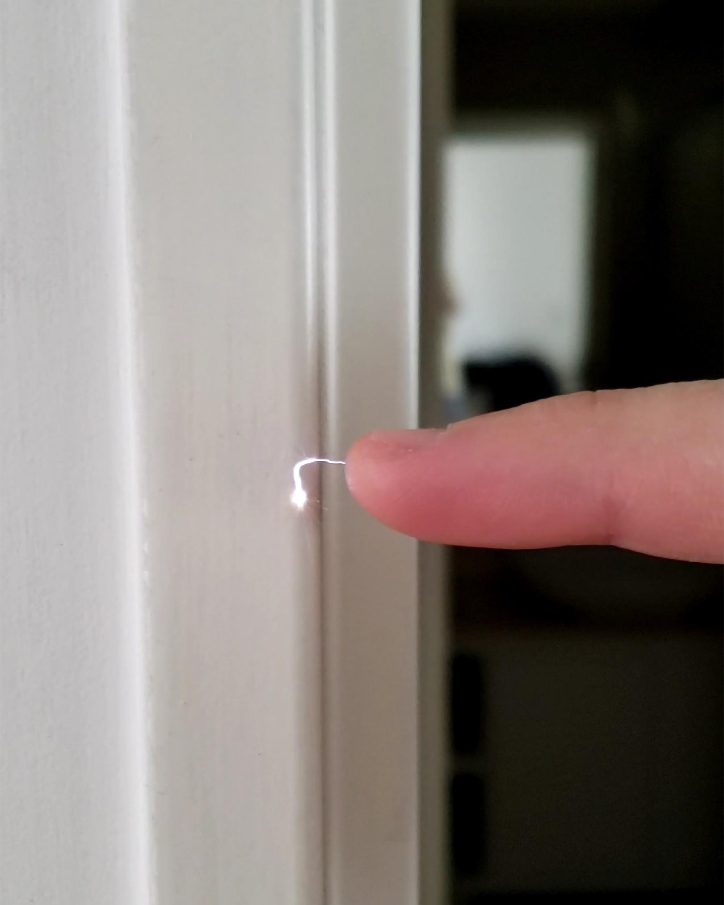
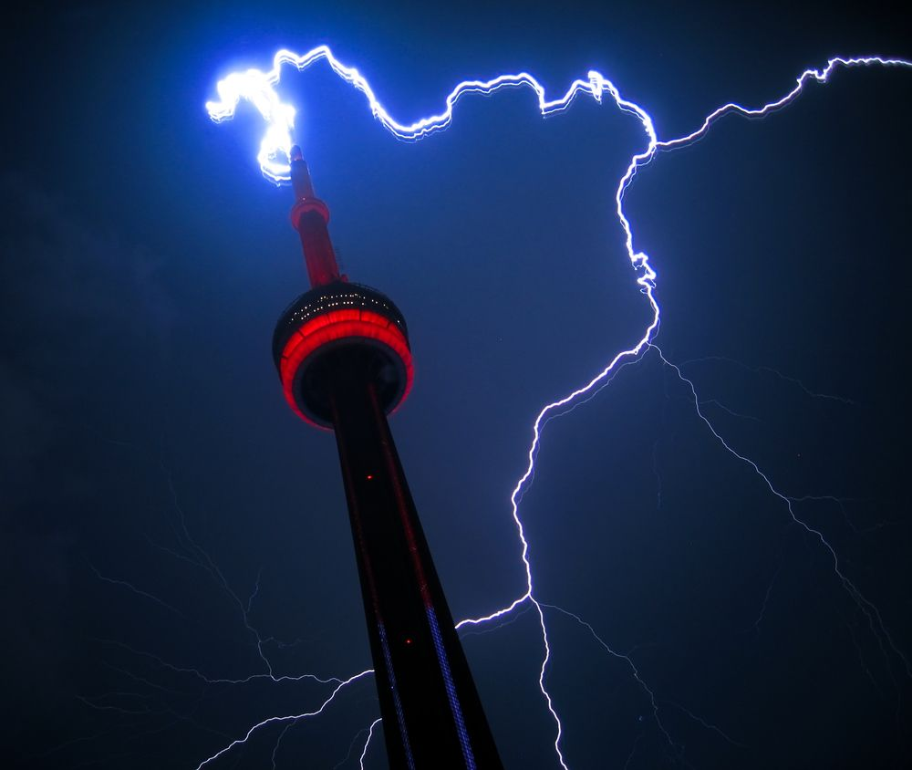

### Electricity and Magnetism

Have you ever walked across a fuzzy carpet, reached for a metal doorknob, and felt a tiny zap? Or watched a massive bolt of lightning split the sky during a thunderstorm? Believe it or not, that tiny spark on your finger and that giant lightning bolt from space are the exact same thing. They are both demonstrations of static electricity.

#### What is Static Electricity?

Everything around you is made of tiny building blocks called atoms. Inside those atoms are even tinier particles. Protons have a positive (+) charge, and electrons have a negative (-) charge. Usually, an object has a balance of protons and electrons, so it’s neutral.

But magic happens when we rub things together! Here's a video demonstrating exactly that:

::video[Short demo of an Static Electricity](videos/staticelectricitydemo.mp4)

 When you rub certain materials, you scrub off negative electrons. One object steals them, becoming negatively charged, while the other becomes positively charged. This buildup of charge that stays on an object is called **static electricity**.

Here's another clear capture of static:

In the close-up picture of a finger touching a door, that tiny, bright spark isn’t just light—it’s a jump of electrons from the finger to the door. These jumping electrons heat up the air for a split second, creating that mini-bolt of lightning made out of plasma right on the fingertip!

#### When the Sky Gets Imbalanced: Lightning

Now, let’s get bigger. Much bigger. That close-up picture of your finger and the amazing photo of lightning hitting a tower are almost identical—just on different scales.

Inside a giant thundercloud, tiny ice crystals are zooming around and crashing into each other. This rubbing action acts just like your shoes on a carpet, but on a massive level. The bottom of the cloud builds up a huge negative charge, while the ground below becomes positively charged.

The air between the cloud and the ground is an insulator, meaning it blocks the flow of electricity. But when the charge gets powerful enough—**CRACK!**—electricity forces its way through the air. A giant spark jumps between the cloud and the ground to restore balance. We call that lightning.

::video[Thunderstorms from Space](videos/iss_storms.gif)

Looking at the video of lightning from the International space station, you can see it from a whole new angle: above the clouds! It’s a stunning reminder that electricity isn’t just a zap on your finger; it’s a powerful, planet-wide force that literally shapes our atmosphere.

#### The Magnetic Connection

Electricity has a best friend that you can’t see: **Magnetism**. Whenever an electric charge moves (like it does in a lightning bolt or a wire), it creates a magnetic field around it. For the longest time, they used to be thought of as seperate. But now we know for sure that they are completely connected to each other. We even call it Electromagnetism.

This connection runs our modern world. A generator uses spinning magnets to push electrons through wires, creating the electricity that lights our homes. That same electricity whizzing through a wire creates a magnetic field that make all our modern conveniences possible from airconditioning, ipad, the internet, machines, robots, and on and on.