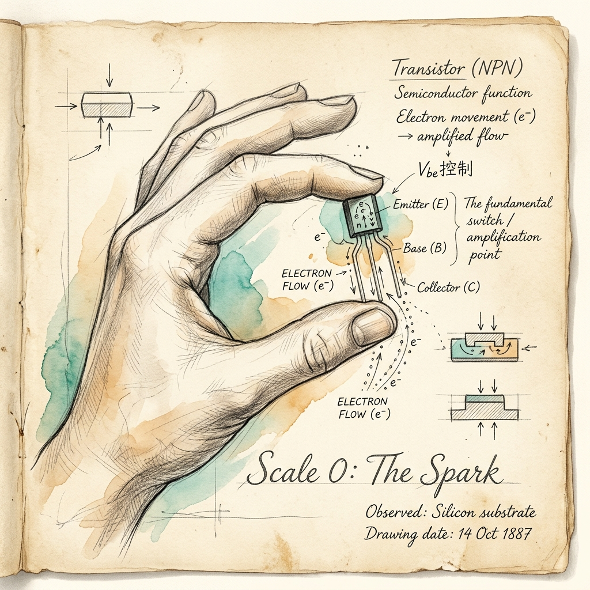
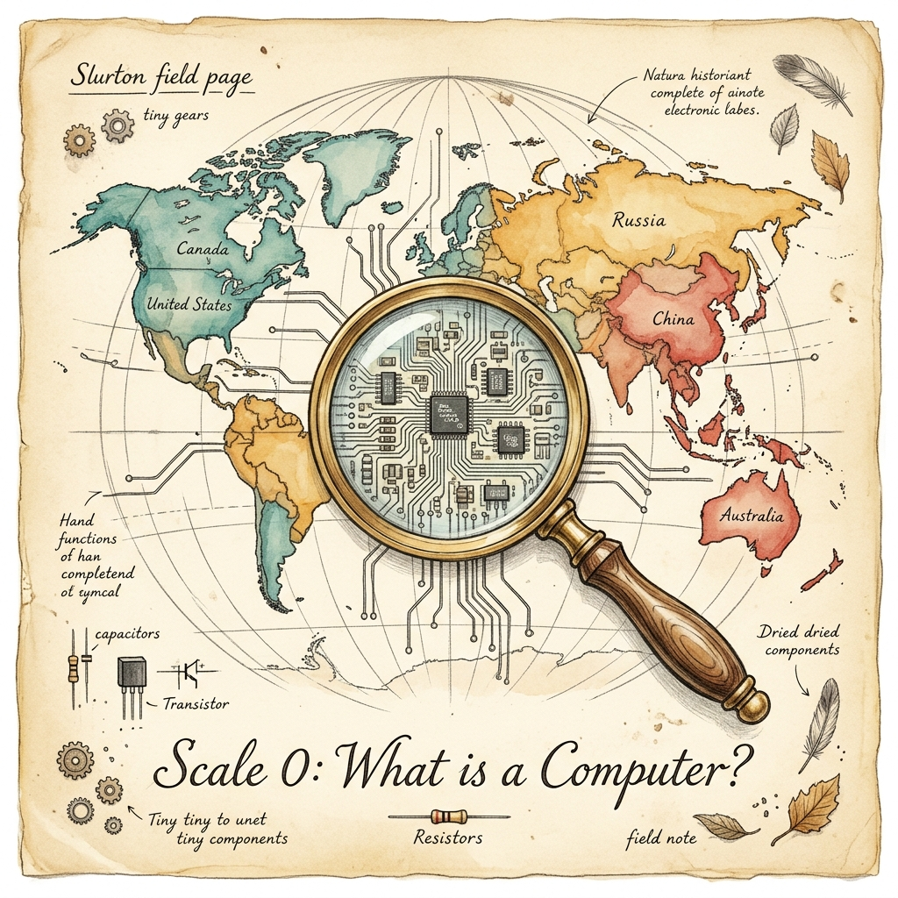

# Scale 0 — The Spark

> *Before anything runs, something has to move.*



---

## 🔍 Anchor Demo: See It Before You Know It

Rub a balloon on your hair. Hold it near a thin stream of water from a tap. Watch the water bend.

That bending is not magic. It is the same force that runs every computer on Earth: **electromagnetism**.

The water bends because the balloon now carries extra electrons — negatively charged particles. The water molecules, which are polar (one side slightly positive, one slightly negative), are attracted to that charge. Invisible force. Visible result.

This is how computing begins: with charge, and what charge does.

---

## 📖 The Substitute Teacher (What Is a Computer?)

Imagine a substitute teacher walks into a class they know nothing about. They have no idea what the lesson is. But they have a **class manual** — a binder with step-by-step instructions.

> *"If the class is quiet, say 'Thank you.' If a student raises a hand, call on them. If the bell rings, dismiss the class."*

That substitute teacher is a CPU. The class manual is a program. The students are data.

A computer is not smart. It follows a manual — precisely, obediently, incredibly fast. Every game, every website, every AI you've used was written as instructions in a manual that a "substitute teacher" followed, step by step, billions of times per second.



---

## ⚡ What Electromagnetism Has to Do With It

Inside every computer chip, transistors act like tiny on/off switches. A transistor is about **5–7 nanometers** wide — roughly 10,000 times thinner than a human hair.

A modern processor holds **over 10 billion** of them.

Each transistor switches on or off using a tiny electrical charge. On = 1. Off = 0. Binary.

**The chain of scale:**

| What | Size | Why It Matters |
|------|------|----------------|
| Electron | 0.00001 nm | Carries the charge |
| Transistor | 5–7 nm | The on/off switch |
| CPU Core | ~1 cm | Billions of transistors |
| Microcontroller | ~3 cm chip | A full computer on one chip |
| Your program | Invisible | Tells all of it what to do |

A lightning bolt and a Google search use the same fundamental force. One is uncontrolled. One is choreographed at 5 GHz.

---

## 🛠 Guided Build: Your First Program in Plain English

Before you write code, write logic. Here is a real program — in English:

```
Start.
Check: Is the temperature above 80°F?
  → YES: Turn the fan on.
  → NO: Keep the fan off.
Wait 1 minute.
Repeat.
```

This is it. This is programming. Everything else — Python, JavaScript, C++ — is just a way to say this in a language a substitute teacher (the CPU) can read.

**Your turn:** Write a program in plain English that:
1. Checks if it is past 9pm.
2. If yes: turns the lights dim.
3. If no: keeps them bright.
4. Repeats every 10 minutes.

There is no "wrong" answer yet. There is only clear thinking.

---

## 🎨 Remix Challenge

Take your plain-English program and change one rule:
- What if it checks *noise level* instead of *time*?
- What if it controls *music volume* instead of *lights*?
- What if it repeats every 1 second instead of 10 minutes?

You just wrote three new programs. None required a keyboard. All required a brain.

---

## Scale Comparison

> One line of code you write → compiled into thousands of instructions → executed by billions of transistors → powered by electromagnetism → revealed by a bent stream of water from a balloon.

*That is the scale of what you just started learning.*
