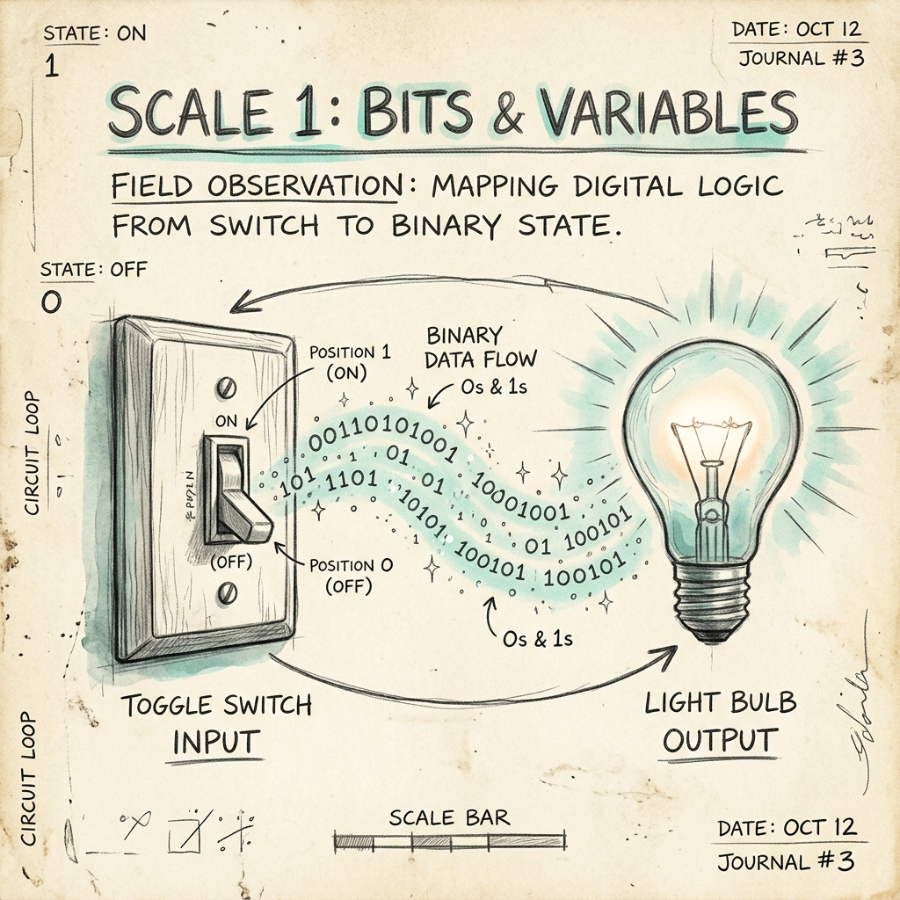

# Scale 1 — Bits & Variables

> *One switch. One light. One thing that changes.*



---

## 🔍 Anchor Demo: The Output First

**Before we define anything — press play.**

Imagine this: a webpage where a button controls a colored box. Press it once — the box turns red. Press it again — it goes back to white.

That is the entire program. Two states. One variable. One action.

```html
<!-- Live demo — run this in your browser -->
<button onclick="toggle()">Press Me</button>
<div id="box" style="width:120px;height:120px;background:white;border:2px solid #333;transition:background 0.4s;margin-top:12px;"></div>

<script>
  let isOn = false;

  function toggle() {
    isOn = !isOn;
    document.getElementById('box').style.background = isOn ? '#f87171' : 'white';
  }
</script>
```

> **Copy this into a new `.html` file. Open it in a browser. Click the button.**

You just ran a program. Now let's understand what just happened.

---

## 📖 What Is a Bit?

A bit is the smallest possible piece of information. It has exactly two states: **0 or 1**. Off or on. False or true.

Your button demo has one bit: the variable `isOn`. It can only be `false` (0) or `true` (1).

When you clicked the button, you flipped a bit. That single flip changed the color of the box. Scale that up: your phone screen has **25 million pixels**, each controlled by bits that flip millions of times per second.

---

## 📦 What Is a Variable?

A variable is a **named container** for a value that can change.

```js
let score = 0;        // a number
let name = "Maya";    // text (a "string")
let isOn = false;     // a boolean (true/false)
```

Think of a variable like a sticky note on a whiteboard:
- The name on the sticky note (`score`, `name`, `isOn`) never changes.
- The value written *on* the sticky note can be erased and rewritten anytime.

---

## 🛠 Guided Build: The Reaction Timer

Build a simple reaction timer. Press a button when the box turns green. See how fast you are.

```html
<!DOCTYPE html>
<html lang="en">
<head>
  <title>Reaction Timer</title>
  <style>
    body { font-family: sans-serif; display:flex; flex-direction:column; align-items:center; padding:40px; gap:20px; background:#0a0e1a; color:#e8ecf4; }
    #target { width:160px; height:160px; background:#1a2040; border-radius:12px; transition:background 0.2s; cursor:pointer; border:2px solid #2a3060; }
    #target.green { background:#4ade80; border-color:#4ade80; }
    #result { font-size:1.4rem; font-weight:700; color:#22d1c3; }
    button { padding:12px 28px; background:#22d1c3; color:#0a0e1a; border:none; border-radius:8px; font-size:1rem; font-weight:700; cursor:pointer; }
  </style>
</head>
<body>
  <h1>Reaction Timer</h1>
  <p>Wait for green, then click the box as fast as you can.</p>
  <div id="target"></div>
  <div id="result">–</div>
  <button onclick="startGame()">Start</button>

  <script>
    let startTime = 0;
    let waiting = false;

    function startGame() {
      const target = document.getElementById('target');
      const result = document.getElementById('result');
      
      target.classList.remove('green');
      result.textContent = 'Wait for it…';
      waiting = false;

      // Random delay between 1 and 4 seconds
      let delay = 1000 + Math.random() * 3000;

      setTimeout(() => {
        target.classList.add('green');
        startTime = Date.now();
        waiting = true;
      }, delay);
    }

    document.getElementById('target').addEventListener('click', () => {
      if (!waiting) return;
      let elapsed = Date.now() - startTime;
      waiting = false;
      document.getElementById('target').classList.remove('green');
      document.getElementById('result').textContent = `${elapsed}ms — ${elapsed < 200 ? '⚡ Lightning!' : elapsed < 350 ? '👍 Good' : '🐢 Slow...'}`;
    });
  </script>
</body>
</html>
```

**Save as `reaction.html`, open in browser, press Start.**

Variables used:
- `startTime` — stores *when* the box turned green
- `waiting` — a boolean that tracks game state
- `elapsed` — stores how many milliseconds passed

Three variables. One complete game.

---

## 🎨 Remix Challenge

Pick one:
1. **Change the color** — make it turn blue instead of green. What variable controls color?
2. **Change the label** — instead of "Lightning / Good / Slow," write your own three tier labels.
3. **Add a score** — add a variable called `attempts` that counts up each time you click, and display it.

You have the code. Pull one thread and see what unravels.

---

## Scale Comparison

> **One bit** (`true`/`false`) → **One variable** → **One interaction** → **A reaction timer game**

Next scale: what happens when the program has to *choose* between more than two things?
