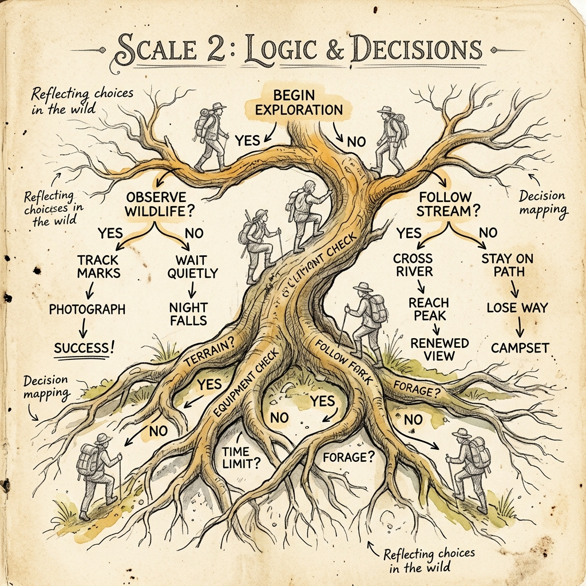

# Scale 2 — Logic & Decisions

> *The computer never guesses. It asks a question, gets YES or NO, and acts.*



---

## 🔍 Anchor Demo: Watch It Decide

Before reading a single definition, look at this output:

```
Temperature: 95°F
→ Fan: ON
→ Alert: "Too hot!"
→ AC: ON
```

```
Temperature: 72°F
→ Fan: OFF
→ Alert: none
→ AC: OFF
```

Same program. Different input. Completely different behavior. That is logic at work.

---

## 📖 How Computers Make Decisions

Every decision a computer makes is built from three things:

### 1. Conditions (`if`)
A condition is a question with a YES or NO answer.
- Is `temperature > 90`? YES or NO.
- Is `score >= 100`? YES or NO.
- Is `username === "admin"`? YES or NO.

### 2. Branching (`if / else if / else`)
Based on the answer, the program takes a different path.

```js
let temperature = 95;

if (temperature > 90) {
  console.log("Too hot! AC on.");
} else if (temperature > 75) {
  console.log("A bit warm. Fan on.");
} else {
  console.log("Comfortable. All off.");
}
```

### 3. Comparison Operators

| Operator | Meaning |
|----------|---------|
| `===` | Exactly equal |
| `!==` | Not equal |
| `>` | Greater than |
| `<` | Less than |
| `>=` | Greater than or equal |
| `<=` | Less than or equal |

---

## 🛠 Guided Build: The Mood Light

A web page that changes color and mood based on a slider. Move the slider — the room changes.

```html
<!DOCTYPE html>
<html lang="en">
<head>
  <title>Mood Light</title>
  <style>
    * { margin:0; padding:0; box-sizing:border-box; }
    body { font-family: 'Inter', sans-serif; min-height:100vh; display:flex; flex-direction:column; align-items:center; justify-content:center; gap:32px; transition: background 0.6s; background: #0a0e1a; }
    h1 { font-size:2rem; font-weight:800; letter-spacing:-1px; transition: color 0.6s; color: #e8ecf4; }
    #mood-label { font-size:1.2rem; font-weight:500; transition: color 0.6s; color: #8b95b0; }
    input[type=range] { -webkit-appearance:none; width:280px; height:8px; border-radius:4px; outline:none; cursor:pointer; }
    input[type=range]::-webkit-slider-thumb { -webkit-appearance:none; width:24px; height:24px; border-radius:50%; background:#fff; box-shadow:0 2px 8px rgba(0,0,0,0.4); cursor:pointer; }
    #orb { width:180px; height:180px; border-radius:50%; transition: background 0.6s, box-shadow 0.6s; }
    p { font-size:0.85rem; color:#5a647e; }
  </style>
</head>
<body>
  <h1 id="title">Mood Light</h1>
  <div id="orb"></div>
  <div id="mood-label">Move the slider</div>
  <input type="range" id="slider" min="0" max="100" value="50">
  <p>Try setting it to 0, 50, and 100</p>

  <script>
    const slider = document.getElementById('slider');
    const orb = document.getElementById('orb');
    const moodLabel = document.getElementById('mood-label');
    const title = document.getElementById('title');

    function updateMood() {
      let value = parseInt(slider.value);
      let color, glow, bg, mood;

      if (value <= 20) {
        color = '#60a5fa';      // blue
        glow = 'rgba(96,165,250,0.4)';
        bg = '#060d1f';
        mood = '🌙 Night Mode — Deep focus.';
      } else if (value <= 50) {
        color = '#22d1c3';      // teal
        glow = 'rgba(34,209,195,0.4)';
        bg = '#0a0e1a';
        mood = '🌿 Calm — Steady and clear.';
      } else if (value <= 80) {
        color = '#f5c842';      // gold
        glow = 'rgba(245,200,66,0.4)';
        bg = '#100d00';
        mood = '☀️ Warm — Energy rising.';
      } else {
        color = '#f87171';      // red
        glow = 'rgba(248,113,113,0.5)';
        bg = '#1a0505';
        mood = '🔥 Full Power — Maximum intensity.';
      }

      orb.style.background = color;
      orb.style.boxShadow = `0 0 60px 20px ${glow}`;
      document.body.style.background = bg;
      moodLabel.textContent = mood;
      moodLabel.style.color = color;
      title.style.color = color;
    }

    slider.addEventListener('input', updateMood);
    updateMood();
  </script>
</body>
</html>
```

**Save as `mood.html`, open in browser, drag the slider.**

Four distinct conditions. Four different states. One slider.

Look at the code: each `if / else if / else` block is a fork in the road. The program asks: *"Where are we?"* and takes the right path.

---

## 🧠 Combining Conditions

You can chain conditions with logical operators:

```js
// AND — both must be true
if (temperature > 80 && humidity > 60) {
  console.log("Uncomfortable. AC on.");
}

// OR — at least one must be true
if (isRaining || isCloudy) {
  console.log("Take an umbrella.");
}

// NOT — flip the truth
if (!isLoggedIn) {
  console.log("Please log in.");
}
```

---

## 🎨 Remix Challenge

Pick one:
1. **Add a 5th mood** — change the slider to go 0–120 and add a new color/mood above 100. What would you call it?
2. **Add an emoji** — display a giant emoji in the orb instead of just color. Pick one per mood level.
3. **Add an alarm** — if value hits 100, make the page title blink or show an alert. (Hint: use `setInterval`.)

---

## Scale Comparison

> **One condition** (`if`) → **Four branches** → **A live-changing mood light**

One real use case: thermostats. Smart home systems. Traffic lights. Login systems. Every one of them is just `if`, `else if`, `else` — thousands of times, chained together.

Next scale: what happens when the same decision needs to repeat?
