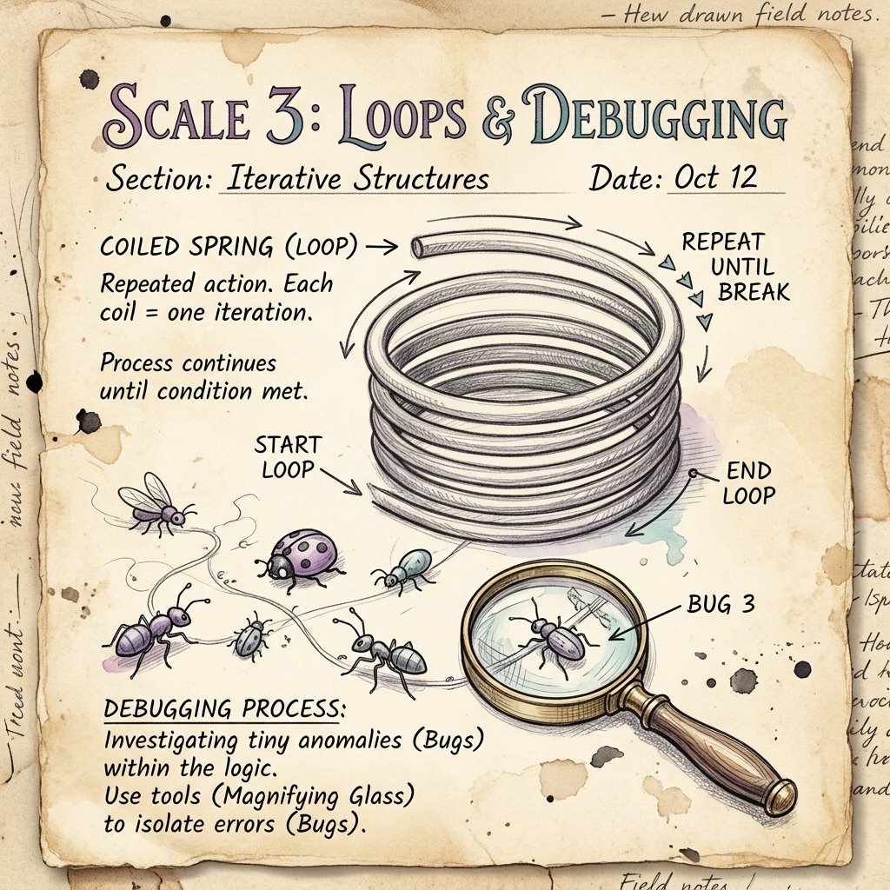

# Scale 3 — Loops & Debugging

> *Repeat until right. The art of doing the same thing — slightly differently — until it works.*



---

## 🔍 Anchor Demo: Watch It Animate

Before we talk loops, look at this:

```
Frame 1:  ■ □ □ □ □
Frame 2:  □ ■ □ □ □
Frame 3:  □ □ ■ □ □
Frame 4:  □ □ □ ■ □
Frame 5:  □ □ □ □ ■
Frame 6:  □ □ □ ■ □
Frame 7:  □ □ ■ □ □  (bouncing back)
...
```

A bouncing dot. That's 20+ lines of output — but it was written in **4 lines of loop code**.

That is why loops exist: because computers are infinitely patient, and humans are not.

---

## 📖 What Is a Loop?

A loop tells the computer: *"Do this thing — again and again — until I say stop."*

### The `for` Loop — When You Know How Many Times

```js
for (let i = 0; i < 5; i++) {
  console.log("Step " + i);
}
// Prints: Step 0, Step 1, Step 2, Step 3, Step 4
```

- `let i = 0` — start counting from 0
- `i < 5` — keep going while i is less than 5
- `i++` — add 1 to i each time

### The `while` Loop — When You Don't Know How Many Times

```js
let temperature = 95;
while (temperature > 70) {
  console.log("Cooling... " + temperature + "°F");
  temperature -= 5;   // cool down by 5 each step
}
console.log("Done. " + temperature + "°F");
```

Use `while` when the loop should run until something changes — like waiting for the temperature to drop, or waiting for a user to log in.

---

## 🛠 Guided Build: LED Pattern Animator

An animated LED strip in your browser. Watch it run, then control it.

```html
<!DOCTYPE html>
<html lang="en">
<head>
  <title>LED Pattern</title>
  <style>
    * { margin:0; padding:0; box-sizing:border-box; }
    body { background:#0a0e1a; color:#e8ecf4; font-family:'Inter',sans-serif; display:flex; flex-direction:column; align-items:center; justify-content:center; min-height:100vh; gap:28px; }
    h1 { font-size:1.6rem; font-weight:800; color:#22d1c3; }
    #strip { display:flex; gap:10px; padding:20px; background:#0f1323; border-radius:16px; border:1px solid rgba(255,255,255,0.06); }
    .led { width:36px; height:36px; border-radius:50%; background:#1a2040; transition:background 0.12s, box-shadow 0.12s; }
    .led.on { background:#22d1c3; box-shadow:0 0 16px 6px rgba(34,209,195,0.6); }
    .controls { display:flex; gap:12px; }
    button { padding:10px 22px; border:none; border-radius:8px; font-size:0.9rem; font-weight:600; cursor:pointer; transition:all 0.2s; }
    #btn-run { background:#22d1c3; color:#0a0e1a; }
    #btn-run:hover { background:#1a9e94; }
    #btn-stop { background:#f87171; color:#0a0e1a; }
    #btn-stop:hover { background:#dc5c5c; }
    select { padding:10px 14px; border-radius:8px; border:1px solid rgba(255,255,255,0.1); background:#151a30; color:#e8ecf4; font-size:0.9rem; cursor:pointer; }
    #step-label { font-size:0.85rem; color:#5a647e; }
  </style>
</head>
<body>
  <h1>LED Pattern Animator</h1>
  <div id="strip"></div>
  <div id="step-label">Pattern: Bounce · Step: –</div>
  <div class="controls">
    <select id="pattern-select">
      <option value="bounce">Bounce</option>
      <option value="fill">Fill</option>
      <option value="blink">Blink All</option>
      <option value="chase">Chase</option>
    </select>
    <button id="btn-run" onclick="runPattern()">▶ Run</button>
    <button id="btn-stop" onclick="stopPattern()">■ Stop</button>
  </div>

  <script>
    const LED_COUNT = 10;
    let intervalId = null;
    let step = 0;
    let direction = 1;

    // Build the LED strip
    const strip = document.getElementById('strip');
    for (let i = 0; i < LED_COUNT; i++) {
      const led = document.createElement('div');
      led.className = 'led';
      led.id = 'led-' + i;
      strip.appendChild(led);
    }

    function setAll(state) {
      for (let i = 0; i < LED_COUNT; i++) {
        document.getElementById('led-' + i).classList.toggle('on', state);
      }
    }

    function clearAll() {
      setAll(false);
    }

    function tick() {
      const pattern = document.getElementById('pattern-select').value;
      clearAll();

      if (pattern === 'bounce') {
        document.getElementById('led-' + step).classList.add('on');
        document.getElementById('step-label').textContent = `Pattern: Bounce · Step: ${step}`;
        step += direction;
        if (step >= LED_COUNT - 1 || step <= 0) direction *= -1;

      } else if (pattern === 'fill') {
        for (let i = 0; i <= step % (LED_COUNT + 1); i++) {
          const el = document.getElementById('led-' + i);
          if (el) el.classList.add('on');
        }
        document.getElementById('step-label').textContent = `Pattern: Fill · LEDs lit: ${(step % (LED_COUNT + 1)) + 1}`;
        step++;

      } else if (pattern === 'blink') {
        if (step % 2 === 0) setAll(true);
        document.getElementById('step-label').textContent = `Pattern: Blink · Tick: ${step}`;
        step++;

      } else if (pattern === 'chase') {
        for (let i = 0; i < 3; i++) {
          const idx = (step + i) % LED_COUNT;
          document.getElementById('led-' + idx).classList.add('on');
        }
        document.getElementById('step-label').textContent = `Pattern: Chase · Head: ${step % LED_COUNT}`;
        step++;
      }
    }

    function runPattern() {
      stopPattern();
      step = 0;
      direction = 1;
      intervalId = setInterval(tick, 120);
    }

    function stopPattern() {
      if (intervalId) { clearInterval(intervalId); intervalId = null; }
      clearAll();
      document.getElementById('step-label').textContent = 'Stopped.';
    }
  </script>
</body>
</html>
```

**Save as `leds.html`, open in browser. Press Run and switch patterns.**

Look at the `for` loop inside `tick()`. It lights each LED by index number — that is a loop drawing pixels.

---

## 🐛 Debugging: The Art of Finding What Went Wrong

A *bug* is when the program runs but does something unexpected. Debugging is the skill of finding the gap between what you *said* and what you *meant*.

**The three-step method:**

1. **Read the error** — browsers show errors in the Console (press F12). The error message tells you the line number.
2. **Add `console.log()`** — print the value of a variable to see if it is what you expect.
3. **Change one thing at a time** — if you change three things and the bug disappears, you don't know which one fixed it.

**Classic bug:**

```js
// Bug: loop never stops
let i = 10;
while (i > 0) {
  console.log(i);
  i++;   // ← should be i-- !!
}
```

The fix is one character: change `++` to `--`. But finding it requires reading carefully.

---

## 🎨 Remix Challenge

Pick one:
1. **New pattern** — add a `"random"` pattern to the dropdown that turns random LEDs on each tick. (Hint: `Math.random()` and `Math.floor()`.)
2. **Change speed** — add a slider that controls how fast the interval runs (50ms to 500ms).
3. **Change colors** — make different patterns use different LED colors (teal, gold, red, purple). You'll need to set `backgroundColor` instead of using the class.

---

## Scale Comparison

> **One loop** → **10 LEDs** → **Animated patterns** → **The same logic runs every pixel on every screen you own**

A 4K screen has 8.3 million pixels. A display driver loops through them. You just understood how.

Next scale: what if the input isn't a button click — but the real world?
