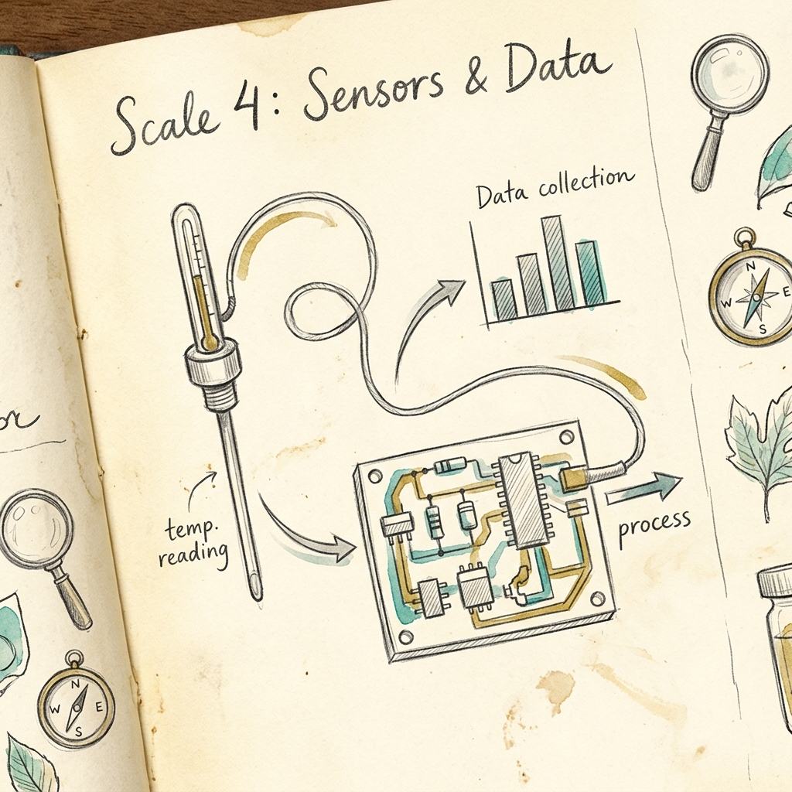

# Scale 4 — Sensors & Data

> *The world is input. Your code is the reader.*



---

## 🔍 Anchor Demo: Watch Data Come In

Before reading anything — look at these numbers streaming in:

```
[12:00:01]  Temp: 72.4°F  |  Light: 840 lux  |  Motion: NO
[12:00:02]  Temp: 72.4°F  |  Light: 839 lux  |  Motion: NO
[12:00:03]  Temp: 72.5°F  |  Light: 215 lux  |  Motion: YES ← someone walked in
[12:00:04]  Temp: 72.5°F  |  Light: 214 lux  |  Motion: YES
[12:00:05]  Temp: 72.6°F  |  Light: 820 lux  |  Motion: NO
```

That is a sensor log. A microcontroller is reading the world, 1000 times per second, and turning what it sees into numbers. Your program responds to the numbers. The world is the input.

---

## 📖 What Is a Sensor?

A sensor is a device that measures something physical and converts it into a number a computer can read.

| Sensor | Measures | Real Use |
|--------|----------|----------|
| Thermistor | Temperature | Thermostat, weather station |
| Photoresistor | Light level | Automatic screen brightness |
| PIR sensor | Motion (infrared) | Security lights, smart doors |
| Microphone | Sound pressure | Voice assistants, noise meters |
| Accelerometer | Movement/tilt | Phone screen rotation, crash detection |
| GPS | Position | Maps, delivery tracking |

Every smart device you own is a loop that reads sensors and decides what to do.

---

## 📊 What Is Data?

Data is just numbers with labels and timestamps. Raw data looks like:

```
72.4, 72.4, 72.5, 72.5, 72.6
```

But the moment you label it and put it in time order, it becomes *information*:

```
Time    | Temperature
--------|-----------
12:00   | 72.4°F
12:01   | 72.5°F
12:02   | 72.6°F
```

And the moment you *compare* it to a threshold, it becomes *action*:

```js
if (temperature > 80) {
  turnFanOn();
}
```

That is the full pipeline: world → sensor → number → comparison → action.

---

## 🛠 Guided Build: The Live Data Dashboard

A simulated sensor dashboard that generates fake "live" data and responds automatically.

```html
<!DOCTYPE html>
<html lang="en">
<head>
  <title>Live Data Dashboard</title>
  <style>
    * { margin:0; padding:0; box-sizing:border-box; }
    body { background:#0a0e1a; color:#e8ecf4; font-family:'Inter',sans-serif; padding:32px; min-height:100vh; }
    h1 { font-size:1.5rem; font-weight:800; color:#22d1c3; margin-bottom:8px; }
    .subtitle { font-size:0.85rem; color:#5a647e; margin-bottom:32px; }
    .dashboard { display:grid; grid-template-columns:repeat(auto-fit,minmax(200px,1fr)); gap:16px; margin-bottom:32px; }
    .card { background:#0f1323; border:1px solid rgba(255,255,255,0.06); border-radius:14px; padding:20px; position:relative; overflow:hidden; transition:border-color 0.4s; }
    .card.alert { border-color:rgba(248,113,113,0.5); }
    .card-label { font-size:0.75rem; font-weight:700; text-transform:uppercase; letter-spacing:1px; color:#5a647e; margin-bottom:8px; }
    .card-value { font-size:2.2rem; font-weight:800; line-height:1; margin-bottom:6px; transition:color 0.4s; }
    .card-unit { font-size:0.8rem; color:#5a647e; }
    .card-status { margin-top:10px; font-size:0.78rem; font-weight:600; padding:4px 10px; border-radius:20px; display:inline-block; }
    .status-ok { background:rgba(74,222,128,0.1); color:#4ade80; }
    .status-warn { background:rgba(248,113,113,0.1); color:#f87171; }
    .log { background:#0f1323; border:1px solid rgba(255,255,255,0.06); border-radius:14px; padding:20px; max-height:220px; overflow-y:auto; }
    .log-title { font-size:0.75rem; font-weight:700; text-transform:uppercase; letter-spacing:1px; color:#5a647e; margin-bottom:12px; }
    .log-entry { font-size:0.78rem; color:#8b95b0; padding:4px 0; border-bottom:1px solid rgba(255,255,255,0.04); font-family:'JetBrains Mono',monospace; }
    .log-entry.event { color:#f5c842; }
    .threshold { font-size:0.7rem; color:#3d4560; margin-top:4px; }
    #chart-row { display:flex; gap:4px; align-items:flex-end; height:60px; margin-top:12px; }
    .bar { flex:1; background:#22d1c3; border-radius:3px 3px 0 0; transition:height 0.3s, background 0.3s; min-height:2px; }
  </style>
</head>
<body>
  <h1>Live Sensor Dashboard</h1>
  <p class="subtitle">Simulated microcontroller data — updating every second</p>

  <div class="dashboard">
    <div class="card" id="card-temp">
      <div class="card-label">🌡 Temperature</div>
      <div class="card-value" id="val-temp">–</div>
      <div class="card-unit">Fahrenheit</div>
      <div class="threshold">Alert threshold: &gt; 85°F</div>
      <div class="card-status" id="status-temp">–</div>
    </div>
    <div class="card" id="card-light">
      <div class="card-label">💡 Light Level</div>
      <div class="card-value" id="val-light">–</div>
      <div class="card-unit">Lux</div>
      <div class="threshold">Alert threshold: &lt; 100 lux</div>
      <div class="card-status" id="status-light">–</div>
    </div>
    <div class="card" id="card-motion">
      <div class="card-label">👁 Motion</div>
      <div class="card-value" id="val-motion" style="font-size:1.6rem;">–</div>
      <div class="card-unit">PIR Sensor</div>
      <div class="card-status" id="status-motion">–</div>
    </div>
    <div class="card" id="card-noise">
      <div class="card-label">🔊 Noise</div>
      <div class="card-value" id="val-noise">–</div>
      <div class="card-unit">Decibels</div>
      <div class="threshold">Alert threshold: &gt; 75 dB</div>
      <div class="card-status" id="status-noise">–</div>
      <div id="chart-row"></div>
    </div>
  </div>

  <div class="log">
    <div class="log-title">Event Log</div>
    <div id="log-entries"></div>
  </div>

  <script>
    // Simulated sensor state
    let temp = 70 + Math.random() * 10;
    let light = 500 + Math.random() * 400;
    let noiseHistory = [];
    let tickCount = 0;

    function noise() { return 30 + Math.random() * 60; }

    function addLog(text, isEvent = false) {
      const log = document.getElementById('log-entries');
      const now = new Date().toLocaleTimeString();
      const entry = document.createElement('div');
      entry.className = 'log-entry' + (isEvent ? ' event' : '');
      entry.textContent = `[${now}]  ${text}`;
      log.prepend(entry);
      if (log.children.length > 40) log.removeChild(log.lastChild);
    }

    function buildBars() {
      const row = document.getElementById('chart-row');
      row.innerHTML = '';
      noiseHistory.forEach(v => {
        const bar = document.createElement('div');
        bar.className = 'bar';
        bar.style.height = Math.max(2, (v / 90) * 60) + 'px';
        if (v > 75) bar.style.background = '#f87171';
        row.appendChild(bar);
      });
    }

    function tick() {
      tickCount++;

      // Drift sensor values realistically
      temp += (Math.random() - 0.48) * 0.4;
      temp = Math.max(60, Math.min(100, temp));
      light += (Math.random() - 0.5) * 30;
      light = Math.max(20, Math.min(1000, light));
      const motion = Math.random() < 0.15;  // 15% chance of motion
      const noiseVal = noise();

      noiseHistory.push(noiseVal);
      if (noiseHistory.length > 20) noiseHistory.shift();

      // Update cards
      const tEl = document.getElementById('val-temp');
      const lEl = document.getElementById('val-light');
      const mEl = document.getElementById('val-motion');
      const nEl = document.getElementById('val-noise');

      tEl.textContent = temp.toFixed(1) + '°';
      lEl.textContent = Math.round(light);
      mEl.textContent = motion ? 'DETECTED' : 'Clear';
      nEl.textContent = noiseVal.toFixed(0);

      // Temperature alert
      const tempHigh = temp > 85;
      document.getElementById('card-temp').classList.toggle('alert', tempHigh);
      tEl.style.color = tempHigh ? '#f87171' : '#22d1c3';
      document.getElementById('status-temp').textContent = tempHigh ? '⚠ Too Hot' : '✓ Normal';
      document.getElementById('status-temp').className = 'card-status ' + (tempHigh ? 'status-warn' : 'status-ok');

      // Light alert
      const lightLow = light < 100;
      document.getElementById('card-light').classList.toggle('alert', lightLow);
      lEl.style.color = lightLow ? '#f87171' : '#f5c842';
      document.getElementById('status-light').textContent = lightLow ? '⚠ Too Dark' : '✓ Normal';
      document.getElementById('status-light').className = 'card-status ' + (lightLow ? 'status-warn' : 'status-ok');

      // Motion
      document.getElementById('card-motion').classList.toggle('alert', motion);
      mEl.style.color = motion ? '#f87171' : '#4ade80';
      document.getElementById('status-motion').textContent = motion ? '⚠ Alert!' : '✓ Clear';
      document.getElementById('status-motion').className = 'card-status ' + (motion ? 'status-warn' : 'status-ok');

      // Noise
      const noiseLoud = noiseVal > 75;
      document.getElementById('card-noise').classList.toggle('alert', noiseLoud);
      nEl.style.color = noiseLoud ? '#f87171' : '#a78bfa';
      document.getElementById('status-noise').textContent = noiseLoud ? '⚠ Too Loud' : '✓ Normal';
      document.getElementById('status-noise').className = 'card-status ' + (noiseLoud ? 'status-warn' : 'status-ok');
      buildBars();

      // Log important events
      if (tickCount % 5 === 0) {
        addLog(`Temp: ${temp.toFixed(1)}°F | Light: ${Math.round(light)} lux | Noise: ${noiseVal.toFixed(0)}dB`);
      }
      if (tempHigh) addLog('⚠ TEMP ALERT — fan activation triggered', true);
      if (motion) addLog('👁 Motion detected — logging event', true);
      if (noiseLoud) addLog('🔊 Noise threshold exceeded', true);
    }

    tick();
    setInterval(tick, 1000);
  </script>
</body>
</html>
```

**Save as `dashboard.html`, open in browser. Watch it run. Read the event log.**

This is what a microcontroller does — constantly. It reads, it compares, it logs, it acts.

---

## 🎨 Remix Challenge

Pick one:
1. **Add humidity** — add a 5th card for "Humidity (%)" that alerts over 80%. Generate it with `40 + Math.random() * 50`.
2. **Change the threshold** — raise or lower the temperature alert. Watch how often it fires. What's the right threshold for your room?
3. **Add automation** — below the log, add a section called "Automated Actions" that lists what the system would do (e.g., "Fan: ON because temp = 87°F").

---

## Scale Comparison

> **One number** (from a thermistor) → **A comparison** → **A logged event** → **An automated action** → **A smart building**

Google's data centers monitor millions of sensors. They use this same pipeline — read, compare, log, act — millions of times per second, to keep servers cool.

Next scale: put it all together into something that matters.
