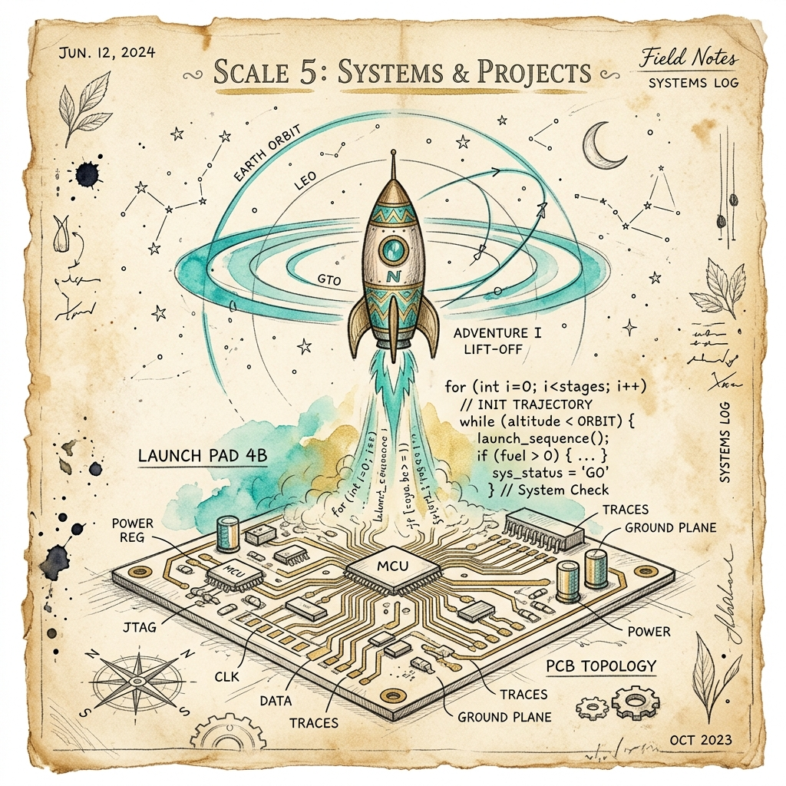

# Scale 5 — Systems & Projects

> *Small pieces become real tools. You've learned the atoms. Now build a molecule.*



---

## 🔍 Anchor Demo: What You Already Know

By now, you have worked with:

| Scale | You built |
|-------|-----------|
| 0 | Plain-English programs, substitute teacher model |
| 1 | Reaction timer with `let`, `if`, `Date.now()` |
| 2 | Mood light with `if/else if/else` and ranges |
| 3 | LED animator with `for` loops and `setInterval` |
| 4 | Live sensor dashboard with events and thresholds |

Now: combine them. One project that uses all of it.

---

## 📖 What Makes Something a System?

A system is when pieces depend on each other.

- A thermostat is a system: **sensor → comparison → decision → actuator**.
- A traffic light is a system: **loop → timer → state machine → LED output**.
- An alarm clock is a system: **input (set time) → loop (check current time) → comparison → output (sound)**.

The difference between a script and a system:
- A script does one thing.
- A system does many things that work together and produce a *reliable result* even when inputs vary.

---

## 🛠 Guided Build: The Personal Command Center

A complete mini-app combining everything: variables, logic, loops, and sensor-like data. This is a personal "situation awareness" tool — a real thing used by flight crews, emergency dispatchers, and mission control teams.

```html
<!DOCTYPE html>
<html lang="en">
<head>
  <title>Command Center</title>
  <meta name="viewport" content="width=device-width, initial-scale=1">
  <link href="https://fonts.googleapis.com/css2?family=Inter:wght@400;500;600;700;800&family=JetBrains+Mono:wght@400;500&display=swap" rel="stylesheet">
  <style>
    * { margin:0; padding:0; box-sizing:border-box; }
    :root {
      --bg: #080c18; --surface: #0f1323; --elevated: #151a30;
      --teal: #22d1c3; --gold: #f5c842; --red: #f87171; --green: #4ade80; --purple: #a78bfa;
      --text: #e8ecf4; --dim: #8b95b0; --muted: #3d4560;
      --border: rgba(255,255,255,0.06);
    }
    body { background:var(--bg); color:var(--text); font-family:'Inter',sans-serif; min-height:100vh; padding:24px; }
    
    .header { display:flex; align-items:center; justify-content:space-between; margin-bottom:28px; }
    .logo { font-size:0.75rem; font-weight:700; letter-spacing:2px; text-transform:uppercase; color:var(--teal); }
    .clock { font-family:'JetBrains Mono',monospace; font-size:1.8rem; font-weight:500; color:var(--text); }
    .clock-sub { font-size:0.75rem; color:var(--muted); text-align:right; margin-top:2px; }

    .grid { display:grid; grid-template-columns:repeat(auto-fit,minmax(280px,1fr)); gap:16px; margin-bottom:20px; }
    
    .panel { background:var(--surface); border:1px solid var(--border); border-radius:16px; padding:20px; }
    .panel-title { font-size:0.7rem; font-weight:700; text-transform:uppercase; letter-spacing:1.5px; color:var(--muted); margin-bottom:16px; }
    
    /* Timer panel */
    .timer-display { font-family:'JetBrains Mono',monospace; font-size:3rem; font-weight:800; color:var(--teal); text-align:center; line-height:1; margin:16px 0; }
    .timer-display.running { animation: pulse 1s infinite; }
    .timer-display.danger { color:var(--red); }
    @keyframes pulse { 0%,100%{opacity:1} 50%{opacity:0.7} }
    .timer-btns { display:flex; gap:10px; }
    .btn { flex:1; padding:10px; border:none; border-radius:8px; font-size:0.85rem; font-weight:700; cursor:pointer; transition:all 0.2s; font-family:'Inter',sans-serif; }
    .btn-start { background:var(--teal); color:#0a0e1a; }
    .btn-start:hover { filter:brightness(1.1); }
    .btn-reset { background:var(--elevated); color:var(--dim); border:1px solid var(--border); }
    .btn-reset:hover { color:var(--text); }
    .timer-input { display:flex; align-items:center; gap:10px; margin-bottom:14px; }
    .timer-input label { font-size:0.8rem; color:var(--dim); white-space:nowrap; }
    input[type=number] { background:var(--elevated); border:1px solid var(--border); border-radius:8px; color:var(--text); font-family:'JetBrains Mono',monospace; font-size:1rem; padding:8px 12px; width:80px; text-align:center; }

    /* Counter panel */
    .counter-display { font-family:'JetBrains Mono',monospace; font-size:3rem; font-weight:800; text-align:center; margin:16px 0; transition:color 0.3s; }
    .counter-btns { display:grid; grid-template-columns:1fr 1fr 1fr; gap:8px; }
    .counter-log { font-size:0.72rem; color:var(--muted); margin-top:12px; font-family:'JetBrains Mono',monospace; max-height:70px; overflow-y:auto; line-height:1.6; }

    /* Notes panel */
    .note-input { width:100%; background:var(--elevated); border:1px solid var(--border); border-radius:8px; color:var(--text); font-family:'Inter',sans-serif; font-size:0.85rem; padding:10px 12px; resize:vertical; min-height:80px; margin-bottom:10px; }
    .note-input:focus { outline:none; border-color:rgba(34,209,195,0.4); }
    .note-list { list-style:none; max-height:140px; overflow-y:auto; }
    .note-item { display:flex; justify-content:space-between; align-items:flex-start; font-size:0.82rem; color:var(--dim); padding:6px 0; border-bottom:1px solid var(--border); gap:8px; }
    .note-item span { flex:1; line-height:1.4; }
    .note-del { background:none; border:none; color:var(--muted); cursor:pointer; font-size:1rem; padding:0 2px; transition:color 0.2s; }
    .note-del:hover { color:var(--red); }
    .note-empty { font-size:0.8rem; color:var(--muted); padding:8px 0; }

    /* Alarm panel */
    .alarm-row { display:flex; gap:10px; margin-bottom:12px; align-items:center; }
    input[type=time] { background:var(--elevated); border:1px solid var(--border); border-radius:8px; color:var(--text); font-family:'JetBrains Mono',monospace; font-size:1rem; padding:8px 12px; }
    .alarm-list { list-style:none; max-height:120px; overflow-y:auto; }
    .alarm-item { display:flex; justify-content:space-between; align-items:center; font-size:0.85rem; padding:7px 0; border-bottom:1px solid var(--border); font-family:'JetBrains Mono',monospace; }
    .alarm-item .alarm-time { color:var(--gold); font-weight:600; }
    .alarm-item .alarm-label { color:var(--dim); font-family:'Inter',sans-serif; font-size:0.78rem; }
    .alarm-item.fired { color:var(--green); }
    
    /* Status bar */
    .status-bar { background:var(--surface); border:1px solid var(--border); border-radius:10px; padding:10px 16px; font-size:0.75rem; color:var(--muted); display:flex; gap:20px; font-family:'JetBrains Mono',monospace; }
    .status-item { display:flex; gap:6px; align-items:center; }
    .dot { width:6px; height:6px; border-radius:50%; background:var(--green); }
    .dot.warn { background:var(--gold); }
    .dot.off { background:var(--muted); }
    
    /* Notification */
    #notif { position:fixed; top:24px; right:24px; background:var(--gold); color:#0a0e1a; padding:12px 20px; border-radius:10px; font-weight:700; font-size:0.9rem; display:none; z-index:999; animation:slidein 0.3s ease; box-shadow:0 8px 32px rgba(245,200,66,0.4); }
    @keyframes slidein { from{transform:translateY(-20px);opacity:0} to{transform:translateY(0);opacity:1} }
  </style>
</head>
<body>
  <div class="header">
    <div>
      <div class="logo">⬡ Command Center</div>
      <div style="font-size:0.75rem;color:var(--muted);margin-top:4px;">Personal Situation Awareness Tool</div>
    </div>
    <div>
      <div class="clock" id="clock">00:00:00</div>
      <div class="clock-sub" id="clock-date">–</div>
    </div>
  </div>

  <div class="grid">
    <!-- Countdown Timer -->
    <div class="panel">
      <div class="panel-title">⏱ Countdown Timer</div>
      <div class="timer-input">
        <label>Duration (minutes):</label>
        <input type="number" id="timer-mins" value="5" min="1" max="120">
      </div>
      <div class="timer-display" id="timer-display">05:00</div>
      <div class="timer-btns">
        <button class="btn btn-start" id="btn-timer" onclick="toggleTimer()">▶ Start</button>
        <button class="btn btn-reset" onclick="resetTimer()">↺ Reset</button>
      </div>
    </div>

    <!-- Tally Counter -->
    <div class="panel">
      <div class="panel-title">🔢 Tally Counter</div>
      <div class="counter-display" id="counter-display" style="color:var(--purple);">0</div>
      <div class="counter-btns">
        <button class="btn btn-reset" onclick="changeCounter(-10)">−10</button>
        <button class="btn btn-reset" onclick="changeCounter(-1)">−1</button>
        <button class="btn btn-reset" onclick="resetCounter()">Reset</button>
        <button class="btn btn-start" onclick="changeCounter(1)" style="background:var(--purple);">+1</button>
        <button class="btn btn-start" onclick="changeCounter(5)" style="background:var(--purple);">+5</button>
        <button class="btn btn-start" onclick="changeCounter(10)" style="background:var(--purple);">+10</button>
      </div>
      <div class="counter-log" id="counter-log">Changes will appear here…</div>
    </div>

    <!-- Notes -->
    <div class="panel">
      <div class="panel-title">📝 Quick Notes</div>
      <textarea class="note-input" id="note-input" placeholder="Type a note and press Enter…" rows="3"></textarea>
      <button class="btn btn-start" onclick="addNote()" style="margin-bottom:12px;width:100%;">+ Add Note</button>
      <ul class="note-list" id="note-list">
        <li class="note-empty">No notes yet.</li>
      </ul>
    </div>

    <!-- Alarm -->
    <div class="panel">
      <div class="panel-title">🔔 Alarms</div>
      <div class="alarm-row">
        <input type="time" id="alarm-time" value="12:00">
        <input type="text" placeholder="Label…" id="alarm-label" style="flex:1;background:var(--elevated);border:1px solid var(--border);border-radius:8px;color:var(--text);font-family:Inter,sans-serif;font-size:0.85rem;padding:8px 12px;">
        <button class="btn btn-start" onclick="addAlarm()" style="width:auto;padding:8px 14px;">Set</button>
      </div>
      <ul class="alarm-list" id="alarm-list">
        <li style="font-size:0.8rem;color:var(--muted);padding:8px 0;">No alarms set.</li>
      </ul>
    </div>
  </div>

  <div class="status-bar" id="status-bar">
    <div class="status-item"><div class="dot" id="dot-timer"></div><span id="stat-timer">Timer: idle</span></div>
    <div class="status-item"><div class="dot" id="dot-alarm"></div><span id="stat-alarm">Alarms: 0</span></div>
    <div class="status-item"><div class="dot off"></div><span id="stat-notes">Notes: 0</span></div>
    <div class="status-item"><div class="dot"></div><span id="stat-counter">Counter: 0</span></div>
  </div>

  <div id="notif"></div>

  <script>
    // ── Clock ──
    function updateClock() {
      const now = new Date();
      document.getElementById('clock').textContent = now.toLocaleTimeString('en-US', {hour12:false});
      document.getElementById('clock-date').textContent = now.toLocaleDateString('en-US', {weekday:'long',month:'long',day:'numeric'});
      checkAlarms(now);
    }
    setInterval(updateClock, 1000);
    updateClock();

    // ── Timer ──
    let timerRunning = false;
    let timerInterval = null;
    let timerSeconds = 300;

    function toggleTimer() {
      timerRunning = !timerRunning;
      document.getElementById('btn-timer').textContent = timerRunning ? '⏸ Pause' : '▶ Resume';
      document.getElementById('dot-timer').className = 'dot' + (timerRunning ? '' : ' warn');
      document.getElementById('stat-timer').textContent = timerRunning ? 'Timer: running' : 'Timer: paused';
      if (timerRunning) {
        timerInterval = setInterval(tickTimer, 1000);
      } else {
        clearInterval(timerInterval);
      }
    }

    function tickTimer() {
      timerSeconds--;
      updateTimerDisplay();
      if (timerSeconds <= 0) {
        clearInterval(timerInterval);
        timerRunning = false;
        document.getElementById('btn-timer').textContent = '▶ Start';
        document.getElementById('timer-display').classList.remove('running');
        document.getElementById('timer-display').classList.add('danger');
        showNotif('⏱ Timer finished!');
        document.getElementById('stat-timer').textContent = 'Timer: done';
      }
    }

    function updateTimerDisplay() {
      const mins = Math.floor(timerSeconds / 60);
      const secs = timerSeconds % 60;
      const el = document.getElementById('timer-display');
      el.textContent = `${String(mins).padStart(2,'0')}:${String(secs).padStart(2,'0')}`;
      el.classList.toggle('danger', timerSeconds < 30);
      el.classList.toggle('running', timerRunning);
    }

    function resetTimer() {
      clearInterval(timerInterval);
      timerRunning = false;
      timerSeconds = parseInt(document.getElementById('timer-mins').value) * 60 || 300;
      updateTimerDisplay();
      document.getElementById('btn-timer').textContent = '▶ Start';
      document.getElementById('timer-display').classList.remove('danger','running');
      document.getElementById('stat-timer').textContent = 'Timer: idle';
      document.getElementById('dot-timer').className = 'dot off';
    }
    resetTimer();

    // ── Counter ──
    let counterValue = 0;
    let counterHistory = [];

    function changeCounter(delta) {
      counterValue += delta;
      counterHistory.unshift(`${delta > 0 ? '+' : ''}${delta} → ${counterValue}`);
      if (counterHistory.length > 10) counterHistory.pop();
      document.getElementById('counter-display').textContent = counterValue;
      document.getElementById('counter-display').style.color = counterValue < 0 ? 'var(--red)' : counterValue > 50 ? 'var(--gold)' : 'var(--purple)';
      document.getElementById('counter-log').textContent = counterHistory.join('  ·  ');
      document.getElementById('stat-counter').textContent = `Counter: ${counterValue}`;
    }

    function resetCounter() {
      counterValue = 0;
      counterHistory = [];
      document.getElementById('counter-display').textContent = '0';
      document.getElementById('counter-display').style.color = 'var(--purple)';
      document.getElementById('counter-log').textContent = 'Reset.';
      document.getElementById('stat-counter').textContent = 'Counter: 0';
    }

    // ── Notes ──
    let notes = [];

    document.getElementById('note-input').addEventListener('keydown', e => {
      if (e.key === 'Enter' && !e.shiftKey) { e.preventDefault(); addNote(); }
    });

    function addNote() {
      const text = document.getElementById('note-input').value.trim();
      if (!text) return;
      const note = { text, id: Date.now() };
      notes.unshift(note);
      document.getElementById('note-input').value = '';
      renderNotes();
      document.getElementById('stat-notes').textContent = `Notes: ${notes.length}`;
    }

    function deleteNote(id) {
      notes = notes.filter(n => n.id !== id);
      renderNotes();
      document.getElementById('stat-notes').textContent = `Notes: ${notes.length}`;
    }

    function renderNotes() {
      const list = document.getElementById('note-list');
      if (notes.length === 0) { list.innerHTML = '<li class="note-empty">No notes yet.</li>'; return; }
      list.innerHTML = notes.map(n =>
        `<li class="note-item"><span>${escHtml(n.text)}</span><button class="note-del" onclick="deleteNote(${n.id})">✕</button></li>`
      ).join('');
    }

    // ── Alarms ──
    let alarms = [];
    let firedAlarms = new Set();

    function addAlarm() {
      const time = document.getElementById('alarm-time').value;
      const label = document.getElementById('alarm-label').value.trim() || 'Alarm';
      if (!time) return;
      alarms.push({ time, label, id: Date.now() });
      document.getElementById('alarm-label').value = '';
      renderAlarms();
      document.getElementById('stat-alarm').textContent = `Alarms: ${alarms.length}`;
      document.getElementById('dot-alarm').className = 'dot warn';
    }

    function renderAlarms() {
      const list = document.getElementById('alarm-list');
      if (alarms.length === 0) { list.innerHTML = '<li style="font-size:0.8rem;color:var(--muted);padding:8px 0;">No alarms set.</li>'; return; }
      list.innerHTML = alarms.map(a =>
        `<li class="alarm-item ${firedAlarms.has(a.id) ? 'fired' : ''}">
          <span class="alarm-time">${a.time}</span>
          <span class="alarm-label">${escHtml(a.label)}</span>
          <button class="note-del" onclick="removeAlarm(${a.id})">✕</button>
        </li>`
      ).join('');
    }

    function removeAlarm(id) {
      alarms = alarms.filter(a => a.id !== id);
      firedAlarms.delete(id);
      renderAlarms();
      document.getElementById('stat-alarm').textContent = `Alarms: ${alarms.length}`;
    }

    function checkAlarms(now) {
      const hh = String(now.getHours()).padStart(2,'0');
      const mm = String(now.getMinutes()).padStart(2,'0');
      const currentTime = `${hh}:${mm}`;
      alarms.forEach(alarm => {
        if (alarm.time === currentTime && !firedAlarms.has(alarm.id)) {
          firedAlarms.add(alarm.id);
          showNotif(`🔔 ${alarm.label}`);
          renderAlarms();
        }
      });
    }

    // ── Utils ──
    function showNotif(msg) {
      const el = document.getElementById('notif');
      el.textContent = msg;
      el.style.display = 'block';
      setTimeout(() => { el.style.display = 'none'; }, 4000);
    }

    function escHtml(s) {
      return s.replace(/&/g,'&amp;').replace(/</g,'&lt;').replace(/>/g,'&gt;');
    }
  </script>
</body>
</html>
```

**Save as `command.html`, open in browser.**

This is a system. It has:
- **Variables** — `timerSeconds`, `counterValue`, `notes`, `alarms`
- **Loops** — `setInterval` for clock, timer, alarm checks
- **Logic** — `if` checks for threshold, alarm match, state
- **Data** — arrays storing notes and alarms
- **Events** — user interaction triggering state changes

---

## 🎨 Remix Challenge

Now make it *yours*. Pick one:

1. **Add a focus mode** — a button that dims the page and hides everything except the timer. One click. Full focus.
2. **Add a daily goal tracker** — below counter, show a progress bar: `counterValue / goalValue * 100%`. Let users set the goal.
3. **Add keyboard shortcuts** — pressing `Space` starts/stops the timer, pressing `+` increments the counter. (Hint: `document.addEventListener('keydown', ...)`.)

---

## What You Built Across All 5 Scales

| Scale | Concept | Artifact |
|-------|---------|----------|
| 0 | Electromagnetism → computers → instructions | Plain-English program |
| 1 | Bits → variables → state | Reaction timer |
| 2 | Conditions → branches → behavior | Mood light |
| 3 | Loops → animation → debugging | LED pattern animator |
| 4 | Sensors → data → events | Live sensor dashboard |
| **5** | **All of it → a system → a real tool** | **Command Center** |

> *You didn't learn to code. You learned to think like a computer — and then tell it what to do.*

---

## What Comes Next

These five scales are the atoms of computing. Every system you will ever build — a website, a robot, an AI tool, a mobile app — uses exactly this set of ideas, stacked higher.

The space shuttle's guidance computer ran 4,000 lines of code.  
Your phone runs 40 million.  
Both started here: one bit, one variable, one `if`.

*Scale up.*
